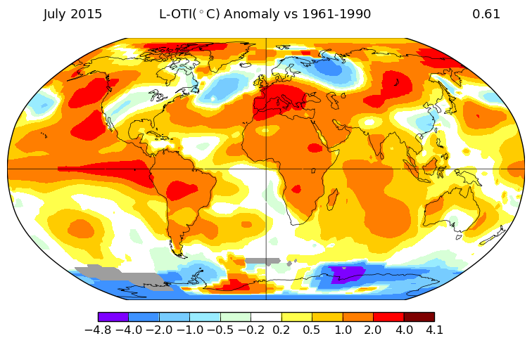
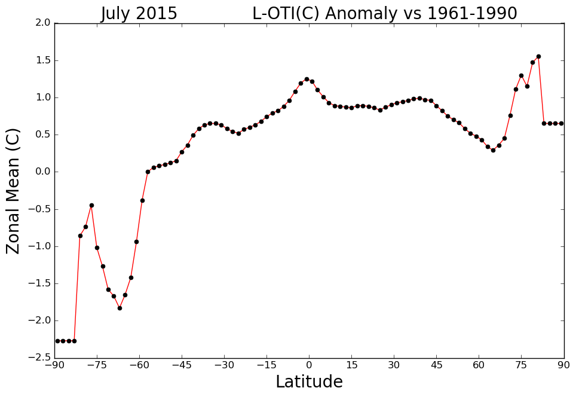
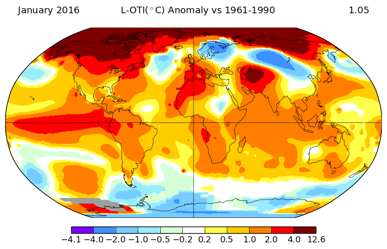
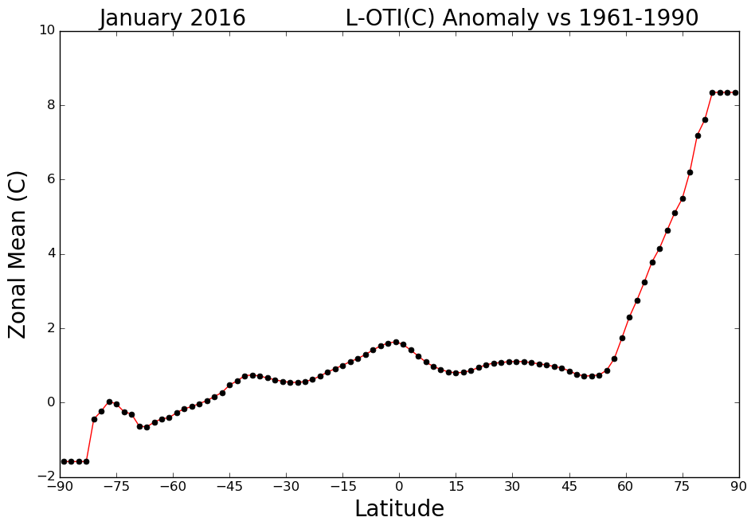

## Q1

> 1. Plot the graph of the all-day radiation on the two days given

```{r}
library(readr)
X0203_Taipei <- read_csv("D:/OneDrive - g.ntu.edu.tw/107-2 Climatology and Practice/week3/0203_Taipei.csv")
X0820_Taipei <- read_csv("D:/OneDrive - g.ntu.edu.tw/107-2 Climatology and Practice/week3/0820_Taipei.csv")

data <- data.frame(matrix(seq(1,24), 24, 1))
colnames(data)[1] <- "Time"
data$ISR_0203 <- X0203_Taipei$SS02 * 10^6 / 3600
#albedo of land type as short grass is 0.26
data$OSR_0203 <- data$ISR_0203 * 0.26

#calculate air emissivity, it is assumpted as the sunlight time within an hour with linear interpolation between 0.65 and 0.85
#at night, the sunlight time would be replace as the median of the sunlight time at day
X0203_Taipei$air_emissivity <- 0
X0203_Taipei$SS01 <- sapply(X0203_Taipei$SS01, as.numeric)
for (i in 1:nrow(X0203_Taipei)){
  if (X0203_Taipei[i,18] == -9999){
    X0203_Taipei[i,49] <- 0.85 - 0.2*median(X0203_Taipei$SS01[which(X0203_Taipei$SS01!=-9999)], na.rm = TRUE)
  }
  else{
    X0203_Taipei[i,49] <- 0.85 - 0.2*X0203_Taipei[i,18]
  }
}

data$ILR_0203 <- X0203_Taipei$air_emissivity * 5.67 * 10^(-8) * (X0203_Taipei$TX01+273.15)^4
#land emissivity type as short grass is 0.95
data$OLR_0203 <- 0.95 * 5.67 * 10^(-8) * (X0203_Taipei$TX01+273.15)^4
data$NR_0203 <- (data$ISR_0203-data$OSR_0203) + (data$ILR_0203-data$OLR_0203)


#doing the same for 0820 data
data$ISR_0820 <- X0820_Taipei$SS02 * 10^6 / 3600
#albedo of land type as short grass is 0.26
data$OSR_0820 <- data$ISR_0820 * 0.26

#calculate air emissivity
#at night, the sunlight time would be replace as the median of the sunlight time at day
X0820_Taipei$air_emissivity <- 0
X0820_Taipei$SS01 <- sapply(X0820_Taipei$SS01, as.numeric)
for (i in 1:nrow(X0820_Taipei)){
  if (X0820_Taipei[i,18] == -9999){
    X0820_Taipei[i,49] <- 0.85 - 0.2*median(X0820_Taipei$SS01[which(X0820_Taipei$SS01!=-9999)], na.rm = TRUE)
  }
  #at 6 A.m & 6 P.M. the sunlight is 0 but may due to the sun has gone down, so we take value one hour before
  else if (X0820_Taipei[i,18] == 0){
    X0820_Taipei[i,49] <- X0820_Taipei[i-1,49]
  }
  else{
    X0820_Taipei[i,49] <- 0.85 - 0.2*X0820_Taipei[i,18]
  }
}

data$ILR_0820 <- X0820_Taipei$air_emissivity * 5.67 * 10^(-8) * (X0820_Taipei$TX01+273.15)^4
#land emissivity type as short grass is 0.95
data$OLR_0820 <- 0.95 * 5.67 * 10^(-8) * (X0820_Taipei$TX01+273.15)^4
data$NR_0820 <- (data$ISR_0820-data$OSR_0820) + (data$ILR_0820-data$OLR_0820)


# plot
library(ggplot2)
library(reshape2)
data2 <- melt(data[,c(1:6)], id.vars="Time")
data3 <- melt(data[,c(1,7,8,9,10,11)], id.vars="Time")
ggplot(data2, aes(x=Time, y=value, color=variable)) + geom_line(size=1) + ylab("Radiation (W/m^2)") +
  ggtitle("The All-Day Radiation on Feb, 3 in Taipei") + theme(plot.title = element_text(size = 20, face = "bold", hjust = 0.5))
ggplot(data3, aes(x=Time, y=value, color=variable)) + geom_line(size=1) + ylab("Radiation (W/m^2)") +
  ggtitle("The all-day Radiation on Aug, 20 in Taipei") + theme(plot.title = element_text(size = 20, face = "bold", hjust = 0.5))
```

> 2. Explain

### 在二月三日的地表能量收支圖中，可以看到長波輻射(LR)的值明顯高過短波輻射(SR)的值，短波輻射雖會在白天因太陽輻射而增加，但因為大氣中的微小粒子較多且雲層較厚，大氣散射(scattering)的現象嚴重，所以地表接收到的短波輻射有限；而在八月二十日的地表能量收支圖中，短波輻射在太陽升起後明顯上升，遠超過長波輻射的值，即是因為當天的天氣晴朗，沒有明顯的散射現象。綜合兩張圖來看，除了因散射現象導致短波輻射增幅不同外，，長波輻射在兩天的值都差不多，這可能是因為夏天的氣溫雖較高，但因雲層較薄且較高，發射率(emissivity)比起冬天來的低，因此冬天的雲層所輻射出的長波輻射較高，兩者相互抵消下兩天便有了差不多的長波輻射值。

## Q2

> 1. Map

```{r}




```

> 2. Explain

### 從圖中可以看到2015年七月的溫度與過去(1961-1990年的平均)比起來升高超過攝氏2度的地區包含太平洋東部、南美洲中部、美洲北端、歐洲西部及西伯利亞東部地區，NCEI的Global Climate Report中提到，這是自1880年有氣溫紀錄以來，全球陸地與海洋平均氣溫最高的一個月，若單從陸地溫度來看，這也是有紀錄以來氣溫第六高的一個月，特別是非洲大陸更是第二高的紀錄，上方提到的幾個比平均溫度高超過攝氏2度的地區，幾乎也都是迎來歷史上前幾高的月均溫；然而，也有零星地區出現了比基值更低的溫度，如俄國西部、東亞與美國中部。以海平面溫度而言，這則是自有紀錄以來最高的海平面月均溫，這個高溫與這一年特別強烈的聖嬰現象(El Nino)有關，至於南極大陸的部分地區則出現了比起過去更低的溫度。聖嬰現象帶來的影響一直持續到隔年的一月，導致了2016年一月是史上最高溫的一月，從圖中可以看到，在接近北極圈的地區溫度明顯比起過去上升許多，若單從陸地溫度來看，這是有紀錄以來第二熱的一月，而從海平面溫度來看，這則是紀錄上最熱的一月，特別是在北極海與東太平洋地區。綜合兩張圖來看，可以看出這在半年之間的全球平均溫度可能都明顯地高於過去，因此在NCEI的報告中特別強調了這次的聖嬰現象格外強烈，才造成如此不尋常的高溫。